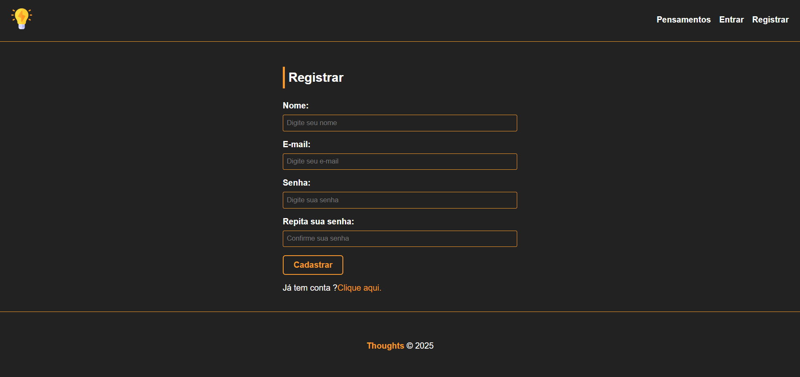
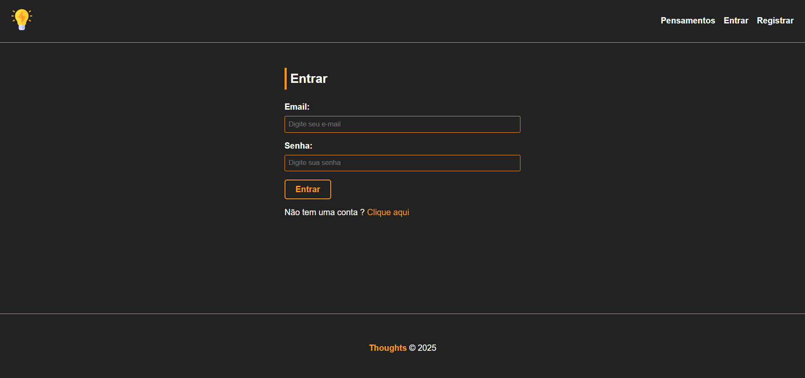
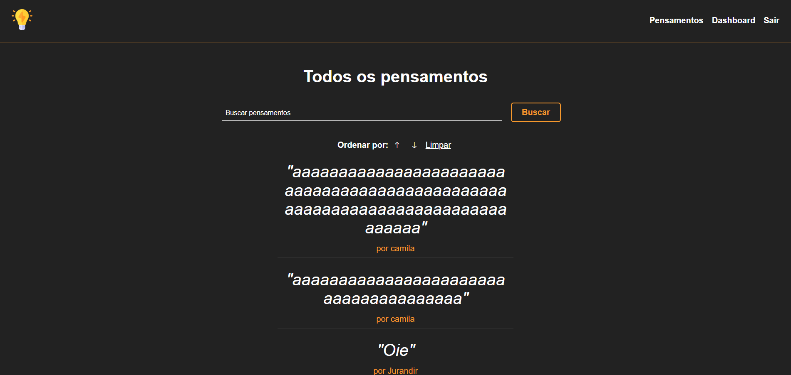
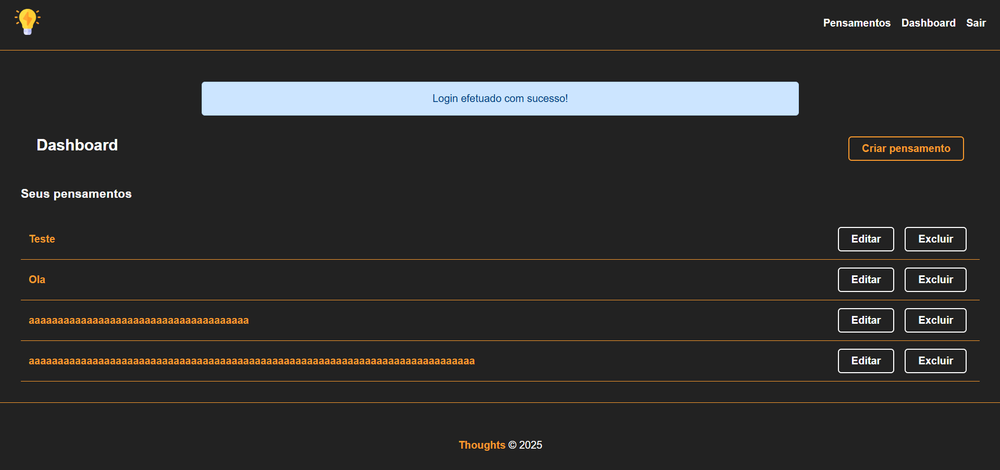
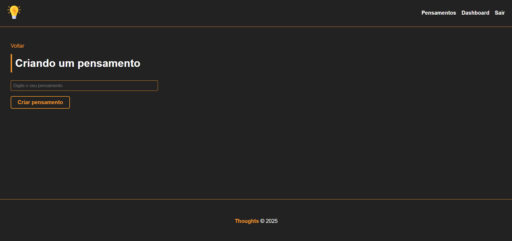

# Thoughts JS

## About the project
**Thoughts** is my first Full-Stack project to practice all my knowledge of the JavaScript ecosystem.  
This project works like a mini social media app, where you need to create an account (or log in, if you already have one) to use it.

You can:
- Post a thought
- See all thoughts (yours and from other users)
- Edit or delete your own thoughts

## Main stacks used
- **Express** – Web framework for Node.js
- **Express-Handlebars** – Template engine
- **MySQL** – Relational database
- **Sequelize** – ORM for SQL databases

## Other dependencies
- **bcryptjs**
- **connect-flash**
- **cookie-session**
- **cookie-parser**
- **express-session**
- **express-flash**
- **session-file-store**
- **nodemon**

**Note**: I started the project writing "toughts" instead of "thoughts" in some places — sorry about that 😅

## 📸 Screenshots

### 📝 Register page

### 🔐 Login page

### 🏠 Home with all thoughts

### 📊 Dashboard with your own thoughts

### ✍️ Page to create a thought

